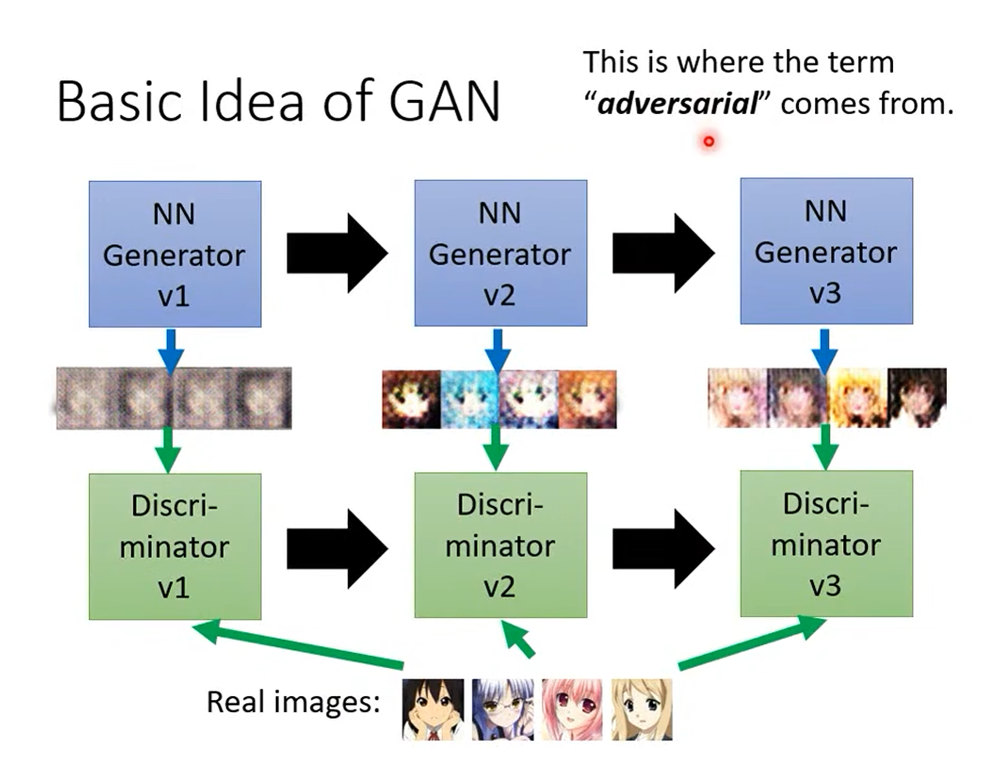
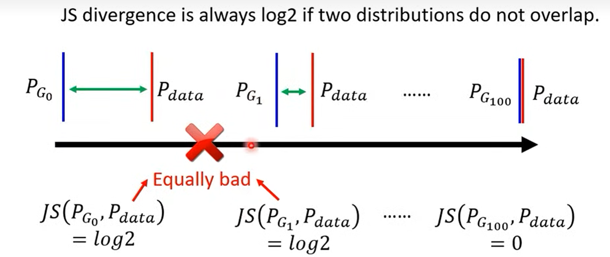
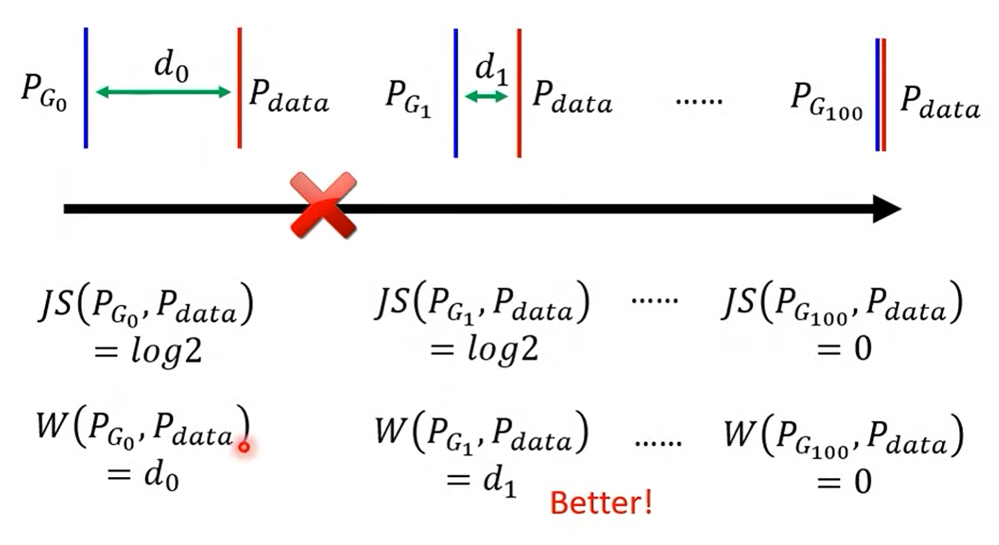

## 基本思想：

一个Generator(**G**)、一个Discriminator(**D**)，Generator负责生成内容，而Discriminator负责识别图像。

Generator训练：一开始G随机生成，将D固定住，将D分辨的结果作为G生成的好坏的评判标准，期望D生成的分数越高越好。

Discriminator训练：将G固定住，把G生成的图像和真实的图像打上不同的标签来训练，就像是训练图片分类一样。

两个训练步骤交替进行。

## JS divergence：

用divergence来衡量生成图像的分布和真实图像分布的差异，JS divergence的思想就是：

对于Discriminator，损失函数就是：
$$
D^*=argmaxV(D,G)\\
其中V(D,G)=E_{y \sim P_{data}}[logD(y)]+E_{y \sim P_G}[log(1-D(y))]
$$
即前一部分为从真实的图像集中抽取的数据，希望D输出的值越高越好。后一部分为从生成的图像集抽取的数据，希望D输出的值越低越好。

那么对于G，就与D相反即可，让上式的值越低，就说明产生的图像跟真实图像越接近：
$$
G^*= argmin(maxV(D,G))
$$
这样的update function还有很多其他的形式，详情可以看：https://arxiv.org/abs/1606.00709

### JS divergence问题：

GAN总是很难训练，例如上面的JS divergence存在一个问题：由于图像在高维空间中分布的很集中，因此如果G生成的图像很可能跟实际图像交集很小，或者没有交集，这时假如抽取的数据样本不够多，可能D很轻易的就把两个数据集给划分开了，那么计算损失函数的值就总是log2，即使交集变大了，生成的图像更接近真实图像了，从损失函数也不能看出来，它总是log2，那么损失函数就失去了意义。

## Wasserstein Distance（WGAN）

通过计算不同分布之间的差距来评估生成图像的好坏，这个差距的计算即从G生成图像的分布变成真实图像的分布所消耗的最短的距离。

这样就解决了JS divergence的问题，即使生成图像跟真实图像差别很大，也可以反映出生成图像是否变得更接近真实图像。损失函数：
$$
max_{D \in 1-Lipschitz} \{E_{x \sim P_{data}}[D(x)]-E_{x \sim P_G}[D(x)] \}
$$
其中1-Lipschitz表示一个斜率不超过1的函数，防止D过大或者过小，不能正确反应生成图像跟真实图像的接近程度。但是怎么具体的设计一个D还是有些问题，下面这两篇文章都是解决这个问题：

### Improved WGAN

https://arxiv.org/abs/1704.00028

### Spectral Normalization

 https://arxiv.org/abs/1802.05957