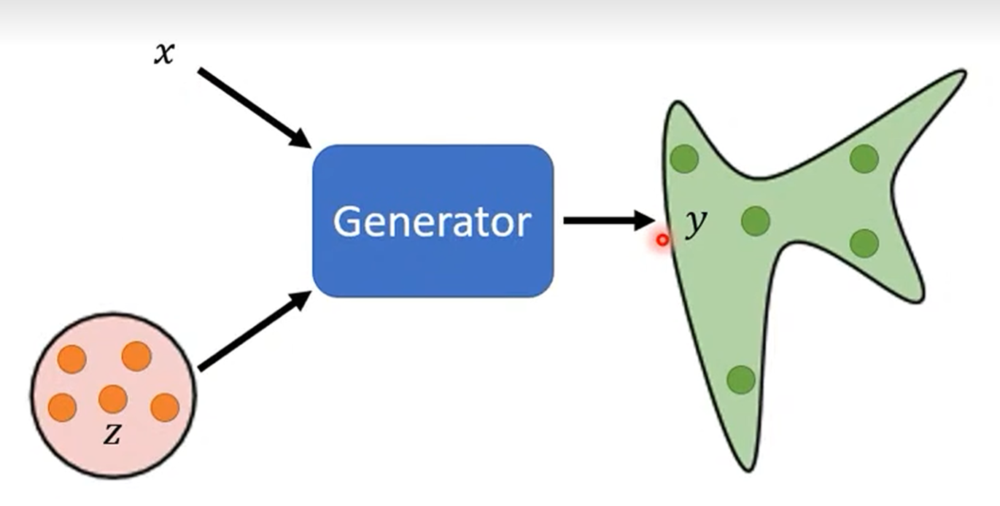

## 基本思想：

Generator的输出中额外要加入一些文字或语音等，用文字来生成特定的图像。

训练Discriminator时，不仅要判断图像是否是生成的，还要判断是否和给定的文字相符。

## 应用：

### Image translation（pix2pix）

不仅仅可以用于文字生成图像，还可以通过文字对图像做变换，例如上色，改变背景等等。

https://arxiv.org/abs/1611.07004

### 语音生成图片

https://arxiv.org/abs/1808.04108

### Talking Head Generation

https://arxiv.org/abs/1905.08233

