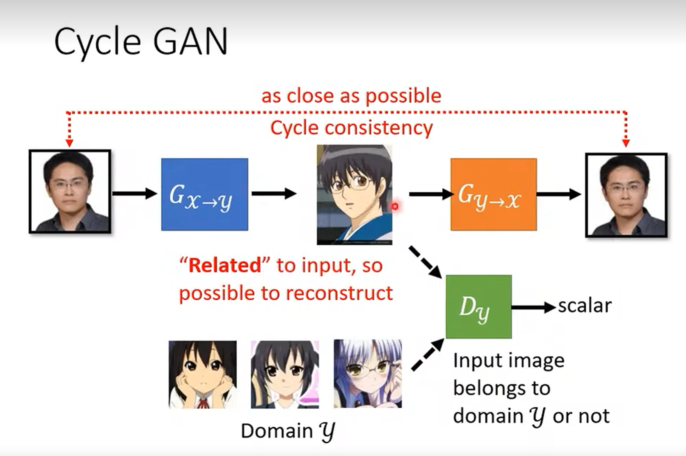

## 基本思想：

图像风格转换，相较于原本的GAN，需要把Generator和Discriminator的输入图像风格区分开。同时要额外添加一个Generator把生成的图像转换回原来的风格，这是为了保证生成的图像跟原来的图像有关联。

https://arxiv.org/abs/1907.10

### 问题：

按照原理来说，可能把一些特征转换成不相干的特征，例如原图中的眼镜抓换成一个二次元耳环，然后检测到这个耳环又还原成眼镜，这样生成图像就和原图像没有关系了，但是实际上几乎不会发生这种问题，这种额外的映射似乎太麻烦了。