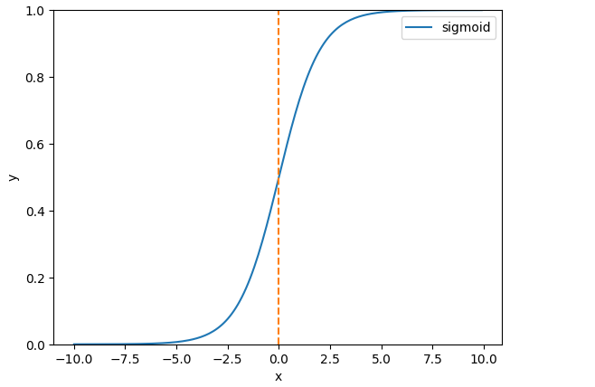

### 概念

逻辑回归是一种用于建立分类模型的机器学习算法，它可以将一个或多个自变量与一个二元分类因变量之间的关系进行建模。逻辑回归模型可以被看作是在一条直线上建立一个“S”形的曲线来描述自变量和因变量之间的关系。这条曲线被称为sigmoid函数。

逻辑回归的目标是使用训练数据集来找到一个最佳的拟合参数集合，这些参数可以用来最大化模型的分类准确性。在训练过程中，逻辑回归会将自变量和因变量之间的关系转换为一个概率值，用来预测一个新的数据点属于某个类别的概率。

逻辑回归对线性回归的结果再进行处理，从而得到一个离散的结果，主要用来解决分类问题。

### Sigmoid函数

$$
f_{\vec{w}, b}(\vec{x}^{(i)})=\frac{1}{1+e^{-{\vec{w}*\vec{x}^{(i)}+b}}}
$$

1. 相应的函数值表示达到1的概率，例如S(2.5) = 0.7即表示达到1的概率为0.7。
2. 根据$-{\vec{w}*\vec{x}^{(i)}+b}$的正负号即可做出分类。

### cost function（最大似然估计）

分类问题中损失函数变为非凸，容易陷入局部最优解而非全局最优解，在linear regression中使用的方差作为损失函数就不再合适了。同时分类问题的y值为一个类别，预测值为一个概率，使用最大似然估计的思想，将不同的预测结果和预测概率求乘积，来获得满足的参数。

#### 成本函数（cost function）

$$
J(\vec{w},b)=\frac{1}{m}\sum_{i=1}^{m}L(f_{\vec{w}, b}(\vec{x}^{(i)}), y^{(i)})
$$

其中：

#### 损失函数（loss function）

$$
L(f_{\vec{w}, b}(\vec{x}^{(i)}), y^{(i)}) = 
\begin{cases}
-log(f_{\vec{w}, b}(\vec{x}^{(i)}))&\text{if }y^{(i)}=1\\
-log(1-f_{\vec{w}, b}(\vec{x}^{(i)}))&\text{if }y^{(i)}=0
\end{cases}
$$

等价于：
$$
L(f_{\vec{w}, b}(\vec{x}^{(i)}), y^{(i)})=-y^{(i)}log(f_{\vec{w}, b}(\vec{x}^{(i)}))-(1-y^{(i)})log(1-f_{\vec{w}, b}(\vec{x}^{(i)}))
$$

分类讨论y的真值在不同情况下， 概率越接近真实类别，损失函数就越小。使用逻辑回归，这种损失函数仍然是凸的，可以逐步的梯度下降得到最优解（未证明）。

### 梯度下降

$$
repeat\{\\&
w_j=w_j-\alpha\frac{\partial}{\partial{w_j}}J(\vec{w},b)\\&
b=b-\alpha\frac{\partial}{\partial{b}}J(\vec{w},b)\\
\}
$$

  

