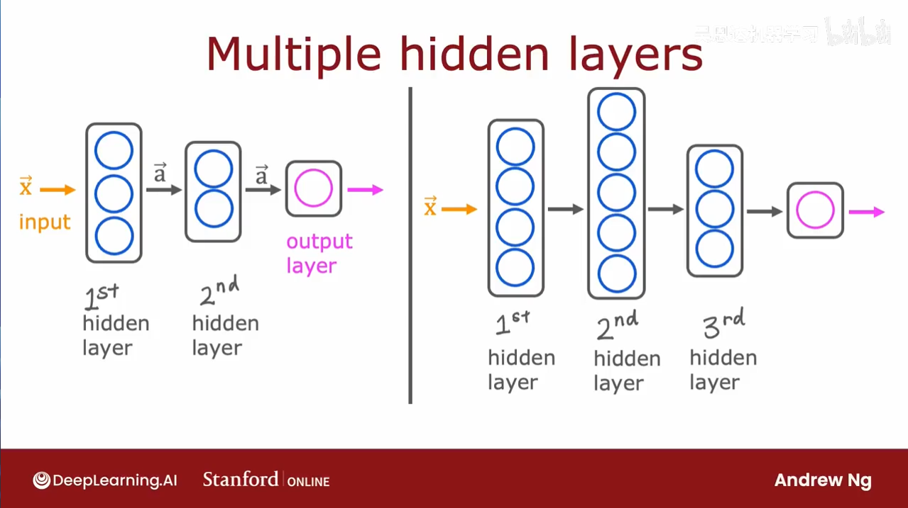
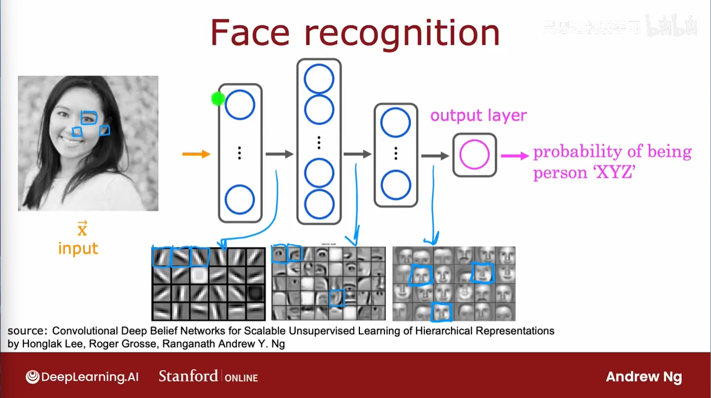
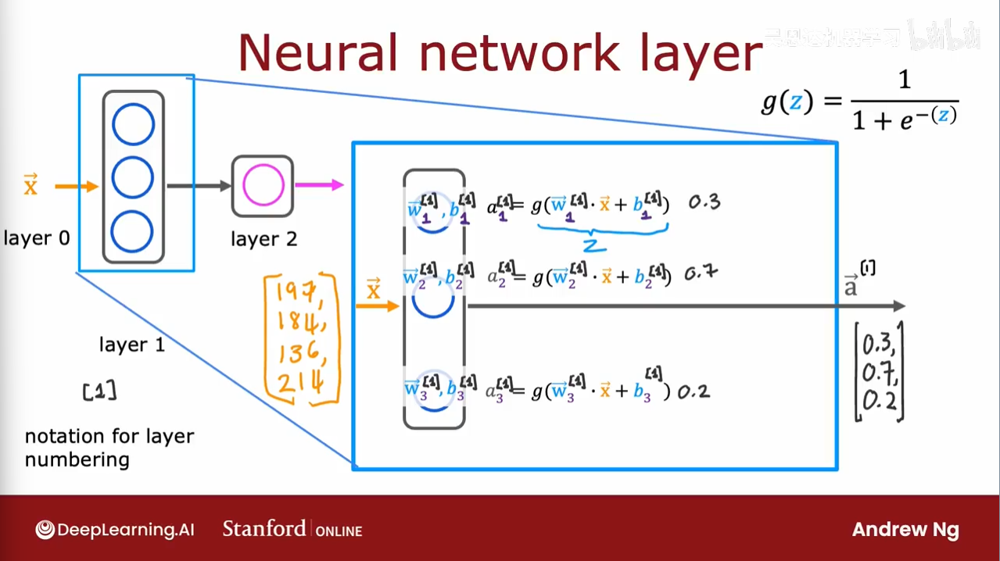

当特征太多时，普通的逻辑回归不能处理这么多特征，这时可以使用神经网络。大脑处理听觉、视觉等不同的信号时使用同一套方法，神经网络就是找出大脑学习的方法，来处理不同的类型数据。

### hidden layer

不需要人来决定有用的特征，通过训练可以自己选择出有用的特征，隐藏层从输入的特征中提取出有用的特征，可能表示不同的含义，也可以构建多隐藏层的网络：

### 多层神经网络特征直观表示

在人脸识别中，输入层的数据是不同的像素点，而在每层隐藏层中可能提取出了不同的特征（检测不同的区域大小）：

这些特征并不是预先规定，而是神经网络在数据集中找到了这些特征。

### 神经网络计算过程

每个神经元的计算与之前的逻辑回归计算过程一致，在参数的右上角加[i]表示是第i层相关的参数。

### 单层神经元表示逻辑运算

### 多类分类

