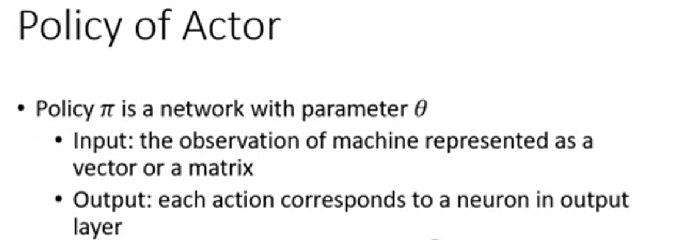
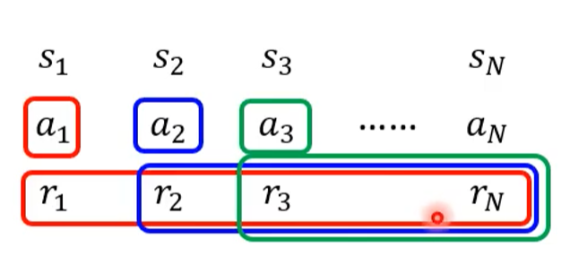
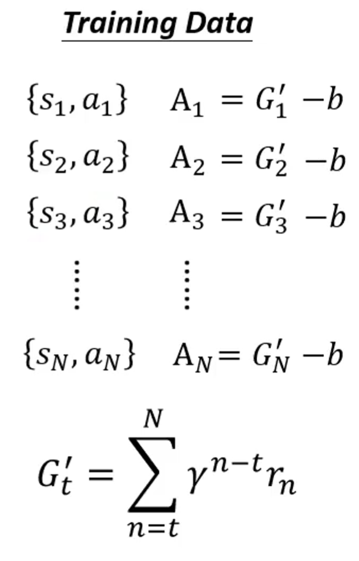
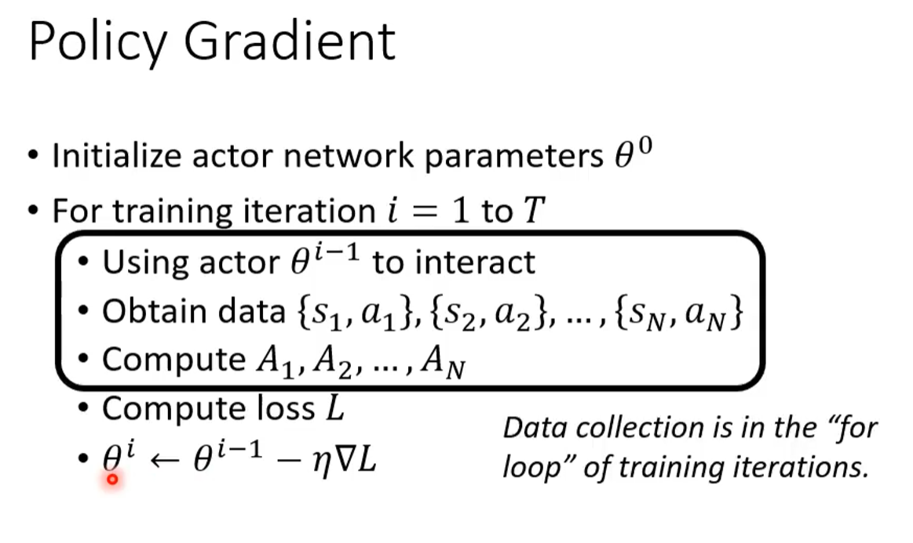
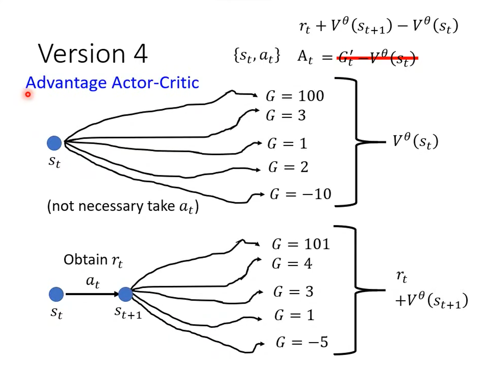
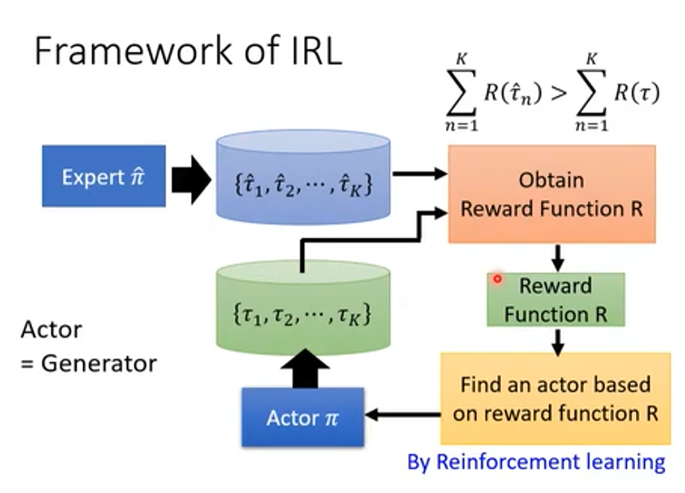

## Actor

actor就是一个policy network，像玩家一样根据输入的当前环境输出要做的每个动作。

## Reward

对于一个给定的action $s_{i}$，计算其reward $G_i$的公式：

1. **cumulated reward**（直接求和到最后一步来表示当前一步的reward）:
   $$
   G_1=r_1+r_2+r_3+……+r_N \\
   G_2=r_2+r_3+……+r_N
   $$

2. **discounted cumulated reward**（考虑最后一步的得分可能跟第一步之间没太大关系，对上式改进）：
   $$
   G_1'=r_1+{\gamma}r_2+{\gamma}^2r_3+……+{\gamma}^{N-1}r_N \\
   G_2'=r_2+{\gamma}r_3+……+{\gamma}^{N-2}r_N
   $$
   其中参数$\gamma<1$

3. **baseline**（如果reward总是正的，不能区分对一个行为是鼓励还是惩罚，所以对上式加一个基准线b，保证对鼓励的行为reward为正，惩罚的行为reward为负）：

   

   对于如何确定一个合适的参数b，下文中再讨论。

**Tips：**一些游戏只有在最后一步才能看出得分，例如围棋结束时计算胜负，此时可能计算中间步数的reward都是0 ，可能训练比较困难，但也是可以训练的，也可以为游戏的中间过程添加一些分数。

### Policy Gradient

与一般的机器学习过程不同的是，RL每次学习完更新参数后还需要再次根据预测的行为来运行一次，并获取新的数据，因此RL每运行一个周期就需要重新收集一次数据。为什么不能只使用最初的数据呢？初始时的网络能力比较差，训练的数据可能不够好，训练数据也要跟着网络不断更新，举个例子就是游戏高手所用的技巧和对游戏的理解都比新手要更强，像是一个萌新在不断的复盘学习一样，只看最初的录像能学到的内容是有限的。

#### On-policy vs Off-policy

上面提到的每次训练完都要收集数据的模式就是**On-policy**，此时用来训练的actor和用来交互的actor是同一个模型，一个明显的缺点就是比较费时间。

与之相对的另一种模式就是**Off-policy**，这时训练几个周期后才收集一次数据，因为训练的actor和交互的actor并不一致，需要解决的问题就是要让训练的actor能根据之前的数据来更新参数，要让训练的actor知道自己和交互产生数据的actor之间存在一些差距，选择性的根据数据内容更新参数，一个比较常用的方法就是**Proximal Policy Optimization（PPO）**。

### Exploration

在收集数据的过程中要尽量多尝试不同的action，这样才能知道不同的行为带来的收益。可以在训练actor的参数中添加噪声，增加输出不同行为的概率。

### Critic

$V^\theta(s)$：对于给定的游戏场景s，预测使用actor $\theta$能得到的discounted cumulated reward，按照这个分数评价actor的好坏。主要有下面两种方法：

#### Monte-Carlo(MC) approach

直接根据当前画面以及互动后的分数来预测对这个画面估计的分数，$V^\theta(s_t)$越接近$G_t'$越好。

#### Temporal-difference(TD) approach

根据之前的discounted cumulated reward计算方法，相邻的操作的得分之间有如下的关系：
$$
V^\theta(s_t)=r_t+{\gamma}r_{t+1}+{\gamma}^2r_{t+2}+……+{\gamma}^{N-1}r_N \\
V^\theta(s_{t+1})=r_{t+1}+{\gamma}r_{t+2}+……+{\gamma}^{N-2}r_N \\
\Rightarrow V^\theta(s_t)=\gamma V^\theta(s_{t+1})+r_t
$$
那么$V^\theta(s_t)-\gamma V^\theta(s_{t+1})$跟$r_t$越接近越好，好处就是这种预测只需要得到一步的得分就够了，不用将所有动作执行完。

### Reward(最终版本)

再回过头来对上式reward的公式进行改进，用$V^\theta(s_t)$作为baseline：
$$
\{s_t,a_t\}:A_t=G'_t-V^\theta(s_t)
$$
含义就是对于$s_t$这个局面，采用$a_t$行为的最终得分和面对$s_t$时的平均得分做差，如果$A_t>0$表示$a_t$是要好于平均情况的，反之则相反。

#### Advantage Actor-Critic

在上述方式下，$G'_t$仅仅是一次$a_t$的分数，有很大的随机性，并不能完全反应$a_t$的好坏。可以更进一步用执行完$a_t$后的得分加此时局面的平均得分来表示$a_t$的最终得分：
$$
\{s_t, a_t\}:A_t=r_t+V^\theta(s_{t+1})-V^\theta(s_t)
$$

### Sparse Reward

很多情况下一场游戏中大部分的action都是没有reward的，这时很难训练网络，需要额外添加一些reward。

#### Reward Shaping

根据对游戏的理解，可以添加一些reward。例如在射击游戏中，可以添加掉血扣分，原地不动扣分等规则来帮助训练。

#### Reward Shaping - Curiosity

引入好奇心这么一项计分规则，对游戏的探索越多得分就越高。例如在超级玛丽中，只要不断的向右走总能见到新的内容，鼓励这一行为也可以帮助训练。

### No Reward：Learning from Demonstration

并非所有的场景都像游戏一样有明确的计分规则，例如自动驾驶场景中。并且人类定义的规则并不一定总是好的，从定义的规则出发得到的actor行为可能很离谱，例如电影机械公敌。

可以给机器一些示范，就像是分类问题一样，但是这样的问题是机器可能学到一些无用的操作（就拿开车举例，没有那么多标准的开车行为，可能司机的一些坏习惯也会被学习下来），以及给出的示范并不一定能覆盖所有的场景（例如自动驾驶，学习的材料里可能没有应对即将发生车祸的情况，那么遇到这种情况可能就什么也不做了）。所以需要的是机器能学习到自己的行为准则，而不仅仅是模仿。

#### Inverse Reinforcement Learning（IRL）

顾名思义，就是和RL相反的过程，通过给定的一些示范，来学习出一个reward规则，并用这个reward规则来训练actor，解决上面的困境。

基本的思路是：有一些示范action后，初始化个actor，然后在每次迭代中，更新reward规则，要保证示范action得到的分数要比自己定义的actor的action得到的分数更高， 然后让actor缩小跟示范action之间的得分差距。经过迭代后得到最终的reward规则，这里的关键点是示范action的得分要始终高于自己定义的actor，就像是不断的向示范action学习，这个过程跟GAN很像。

